# Fluctlight: Minimal Transformer with RoPE

A modern Python implementation of a Transformer model with Rotary Positional Embeddings (RoPE), focusing on efficient text generation and model training.

> The name "Fluctlight" is inspired by Sword Art Online, where it represents the digital soul or consciousness that gives artificial beings their unique personalities and capabilities. Like its namesake, this project aims to create a minimal yet complete implementation that captures the essence of neural processing.

## Overview

Fluctlight is a minimalist implementation of the Transformer architecture that incorporates Rotary Positional Embeddings (RoPE) for enhanced sequence modeling. The project demonstrates how to build and train a compact but effective language model.

### Key Features
- PyTorch-based Transformer architecture
- Rotary Positional Embeddings (RoPE)
- Rich visualization for model training and text generation
- Efficient byte-level tokenization (vocab size: 256)
- Terminal-based interactive text generation UI

## Model Architecture

The Fluctlight model uses the following configuration:
- Vocabulary Size: 256 (byte-level encoding)
- Hidden Dimension: 4
- Number of Heads: 2
- Number of Layers: 2
- Head Dimension: 2
- Context Window: 64 tokens
- Embedding: Rotary Positional Embedding (RoPE)

See the architecture diagrams in `docs/` for detailed visualization.

## Setup and Usage

1. Install UV & Set Up Environment:
```bash
# Install UV if you haven't already
https://docs.astral.sh/uv/getting-started/installation/

# Create virtual environment and activate it
uv venv && source .venv/bin/activate  # Unix-like
# or
uv venv && .venv\Scripts\activate  # Windows

# Install dependencies with UV (faster than pip alone)
uv pip install -r requirements.txt

# For development (optional)
uv pip install -r dev-requirements.txt
```

2. Train the model:
```bash
python -m fluctlight.cli train --train-file data/train.txt --val-file data/val.txt --output-dir checkpoints
```

3. Generate text:
```bash
python -m fluctlight.cli generate --checkpoint checkpoints/model-latest.ckpt --input-text "Hello"
```

4. Run the interactive cycling demo:
```bash
python examples/test_cycling.py
```

## Project Structure

```
fluctlight/
├── fluctlight/        # Core implementation
├── docs/             # Documentation and diagrams
├── examples/         # Usage examples
├── tests/           # Test suite
└── data/            # Training data
```

## Implementation Notes

- The model uses byte-level tokenization, allowing it to handle any text input without a separate tokenizer
- RoPE implementation provides better handling of positional information compared to absolute positional embeddings
- The small model size (4-dimensional embeddings) demonstrates core Transformer concepts while remaining computationally efficient

## AI Usage

AI was used to generate portions of this repository. See [AI.txt](AI.txt) for details about the AI tools and their contributions to the project.

## Author

Tim Cotten <tcotten@scryptedinc.com>
Part of the AVB (Autonomous Virtual Beings) public repository

## License

MIT License