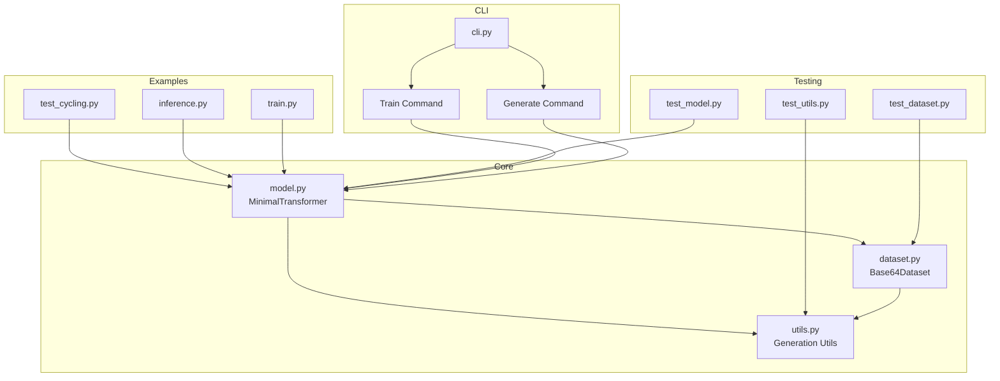

# Code Architecture

The codebase is organized into several key components:

1. **Core Implementation** (`fluctlight/`)
   - `model.py`: MinimalTransformer implementation with RoPE
   - `dataset.py`: Data handling and Base64 dataset
   - `utils.py`: Text generation and encoding utilities
   - `cli.py`: Command-line interface

2. **Examples** (`examples/`)
   - Interactive text generation demos
   - Training scripts
   - Inference examples

3. **Tests** (`tests/`)
   - Comprehensive test suite for all components
   - Integration tests for the full pipeline

The architecture emphasizes modularity and clear separation of concerns, making it easy to extend or modify individual components.
