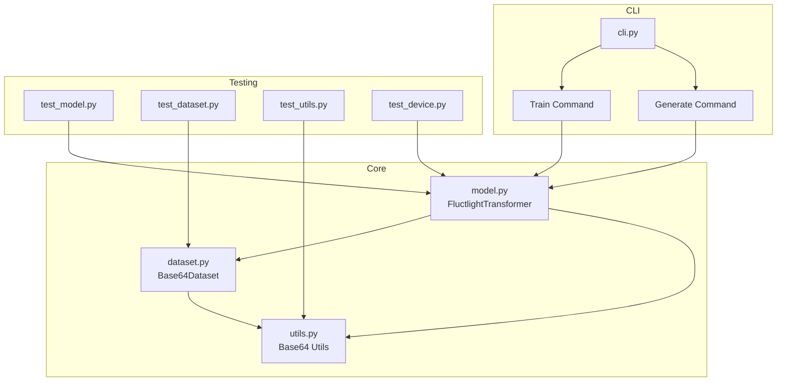

# Fluctlight Code Architecture



## Overview

The Fluctlight project implements a byte-level transformer model with Rotary Position Embeddings (RoPE). The architecture focuses on efficiency and clarity while maintaining core transformer functionality.

## Core Components

### FluctlightTransformer

The main model implementation with the following architecture:

- Vocabulary: 256 tokens (byte-level encoding)
- Embedding Dimension: 4 (compact but effective)
- Attention Heads: 2 (each head dimension: 2)
- Feed-forward Dimension: 8 (2x embedding dimension)
- Context Window: 16 tokens
- Position Encoding: Rotary Positional Embedding (RoPE)

Key features:
- Byte-level tokenization eliminates need for complex tokenizer
- RoPE for enhanced position-aware attention
- Dynamic dropout based on model size
- Efficient context window management

### Dataset Handling

The `Base64Dataset` class provides:
- Loading of base64-encoded input-output pairs
- Optional prepending of training data
- Automatic device placement
- Efficient sequence collation and padding

Data format:
```
base64(input)\tbase64(output)\n
```

### Training Infrastructure

Components for efficient training:
- Automatic device detection (CUDA, MPS, CPU)
- Configurable CPU worker allocation
- Batch collation with padding
- Context window enforcement

## Implementation Details

### Attention Mechanism

The attention implementation uses:
1. RoPE for positional information
2. Causal masking for autoregressive prediction
3. Multi-head attention with efficient head dimension splitting

### Training Process

The training loop:
1. Loads base64-encoded pairs
2. Applies context window limits
3. Shifts sequences for next-token prediction
4. Computes loss with proper padding handling

### Utility Functions

Core utilities:
- Base64 decoding for training data
- Device detection and management
- DataLoader creation with optimal settings
- Sequence collation and padding

## Testing

The test suite covers:
1. Model architecture and forward pass
2. Dataset loading and processing
3. Device handling and tensor placement
4. Training functionality
5. Utility functions

## File Structure

```
fluctlight/
├── model.py      # FluctlightTransformer implementation
├── dataset.py    # Data loading and processing
├── utils.py      # Utility functions
└── cli.py        # Command-line interface

tests/
├── test_model.py    # Model tests
├── test_dataset.py  # Dataset tests
├── test_device.py   # Device handling tests
└── test_utils.py    # Utility function tests
```
