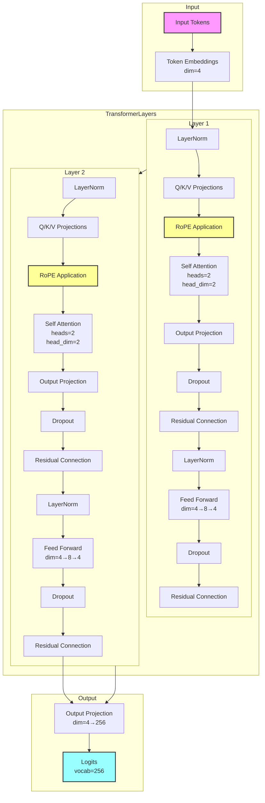

# Model Architecture

## Architectural Details

1. **Input Processing**
   - Byte-level tokenization (vocab size = 256)
   - 4-dimensional token embeddings
   - Context window limited to 64 tokens

2. **Transformer Layers (2x)**
   - **Layer Normalization**
     - Applied before attention and feed-forward operations
   - **Multi-head Self-Attention**
     - 2 heads with head dimension = 2
     - Q, K, V projections (4→4 dimensions)
     - Output projection (4→4 dimensions)
   - **Rotary Positional Embeddings (RoPE)**
     - Applied to queries, keys, and values
     - Provides relative positional information
   - **Causal Masking**
     - Ensures tokens only attend to previous positions
   - **Feed-Forward Network**
     - Two-layer MLP (4→8→4)
     - ReLU activation between layers
   - **Residual Connections**
     - Applied after attention and feed-forward blocks
   - **Dropout**
     - Dynamic rate based on model size: min(0.1, 0.5 * (d_model / 256))
     - Applied before residual connections

3. **Output Generation**
   - Linear projection from 4→256 dimensions
   - Logits over entire byte vocabulary

## Key Features

- **Minimal Yet Complete**: Contains all essential Transformer components in just ~2.9K parameters
- **Dynamic Dropout Scaling**: Automatically adjusts dropout rate based on model size, supporting future expansions
- **RoPE Benefits**: Enhanced handling of relative positions with rotary embeddings
- **Byte-Level Operations**: Works with any text input without special tokenization
- **Device Optimization**: Automatically detects and uses the optimal available device (MPS, CUDA, or CPU)
- **Context Management**: Enforces a 64-token context window by truncating longer sequences

The model is intentionally compact while maintaining the essential Transformer architecture components. This design allows for efficient experimentation and serves as a foundation for progressive model expansion through weight mirroring techniques.