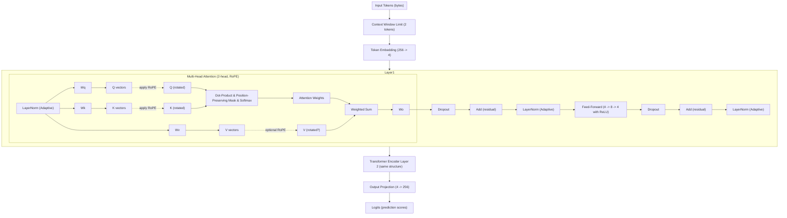
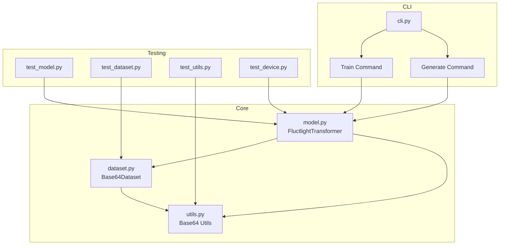

# Fluctlight Transformer – Implementation and Documentation

## A Minimally Viable Transformer w/ Attention, Utilizing RoPE

Below is a complete PyTorch Lightning implementation of a minimal Transformer model. This model uses a vocabulary of 256 (extended ASCII), embedding size 4, two Transformer encoder layers, and two attention heads (each head of dimension 2). It includes token embedding, causal self-attention, a feed-forward network (4 → 8 → 4), residual connections, and layer normalization. The LightningModule handles training and validation steps (using cross-entropy loss).

## Project Design – Model Explanation and Usage

### Purpose and Design Philosophy

This project demonstrates a Fluctlight Transformer – a tiny Transformer model with only 2,656 parameters. The purpose is to create the simplest functional Transformer to illustrate the core principles of a viable transformer with attention capable of simple mimicry tasks. By using extremely small dimensions (embedding size 4, feed-forward hidden size 8, 2 heads of dimension 2, 2 layers), the model is easy to train on a CPU and inspect or even overfit on a small dataset. Starting with such a minimal model (2.6K params) provides a baseline that can be progressively expanded to larger models. This minimal design is great for efficient experimentation: it's small enough to train quickly, and it serves as a starting point for future unfolding (growing the model in size while reusing the learned parameters).

Despite its size, the model includes all key components of a Transformer:
- Token embeddings for a vocabulary of 256 (covering extended ASCII characters)
- Multi-head self-attention mechanism (2 heads, each 2-dimensional) with Rotary Positional Embeddings (RoPE) to encode token positions
- Feed-Forward Network (a two-layer MLP with hidden size 8) at each layer
- Residual connections and Layer Normalization applied after each sub-layer (Add & Norm)
- A final output projection to map the 4-dimensional representations back to 256-dimensional token logits

The use case for this model is primarily experimental. It can learn very simple patterns or mappings (for example, mapping an input string to an output string in the training data). With a very small capacity, it will typically memorize the training data if trained for long, which is useful for verifying that the model and training process are working. In practice, one would not use such a tiny Transformer for real tasks, but it's a stepping stone toward gradually building larger models by unfolding this minimal model.

### Model Architecture

Key architecture hyperparameters and components:
- Parameters: 2,656 (including final normalization layer)
- Vocabulary: 256 tokens, representing extended ASCII. Each character (byte) is a token.
- Embedding Dimension: 4. Each token is represented by a 4-dimensional vector.
- Transformer Encoder Layers: 2 layers in stack. Each layer has:
  - Multi-Head Self-Attention (MHSA): 2 heads of dimension 2 each. Each head attends to the sequence with learned query, key, value projections (Wq, Wk, Wv each of shape 4×4). Position-preserving masking is used to ensure tokens primarily attend to their own positions, preventing unwanted position-based token swapping.
  - Rotary Positional Embedding (RoPE): Applied to Q and K vectors in attention. RoPE encodes positions by rotating Q and K in a 2D subspace for each pair of dimensions, which injects position information as a phase change in dot-product attention.
  - Optional RoPE on V: Experimental feature (disabled by default, v_scale=0.0) for enhanced positional awareness.
  - Feed-Forward Network (FFN): A two-layer MLP applied to each token position. It expands the 4-dim representation to 8-dim (ff_in layer 4→8 with ReLU), then back down to 4-dim (ff_out layer 8→4).
  - Residual Connections: The output of each sub-layer is added back to its input.
  - Layer Normalization: Applied after each addition, with adaptive scaling based on model size.
- Context Window: 2 tokens (minimum viable size for pattern learning)
- Output Projection: A linear layer (4→256) maps the final 4-dimensional token representations to logits over the vocabulary.

### Adaptive Layer Normalization

The model implements a unique adaptive normalization scaling mechanism:

```python
def calculate_norm_scale_factor(self) -> float:
    """Calculate scaling factor for layer normalization based on model size."""
    return min(1.0, max(0.0, (self.d_model - 4) / 28))
```

This scaling ensures:
- At d_model=4 (current): scale = 0.0 (no normalization)
- At d_model=16: scale ≈ 0.43 (partial normalization)
- At d_model=32: scale = 1.0 (full normalization)
- At d_model>32: scale = 1.0 (capped)

The scaling is applied to all three normalization points:
1. After self-attention
2. After feed-forward network
3. Final layer normalization

This design allows the model to smoothly transition from no normalization at its minimal size to full normalization as it grows through Origami expansion.

### RoPE Implementation Details

The model uses a context-aware RoPE implementation that adapts to window size:

```python
def calculate_adaptive_angle_rates(self, dim_idx):
    """Adaptive RoPE frequency calculation."""
    normalized_dim = dim_idx / (self.d_model // 2)
    
    if self.context_window < 16:
        # Tiny contexts (2-16): Steeper hyperbolic curve
        base = 2.0
        scale = max(1.0, 16.0 / self.context_window)
    elif self.context_window < 1024:
        # Standard contexts: Traditional scaling
        base = 10000.0
        scale = 1.0
    else:
        # Massive contexts: Logarithmic scaling
        log_adjustment = math.log(self.context_window / 1024 + 1)
        base = 10000.0 * log_adjustment
        scale = 1.0 / math.sqrt(log_adjustment)
    
    return 1.0 / (base ** (normalized_dim * scale))
```

This implementation:
- Uses steeper curves for tiny contexts (critical for d_model=4)
- Scales appropriately for standard-size contexts
- Adapts logarithmically for massive contexts
- Ensures distinct position encoding even in minimal space

### Architecture Diagram

Below is a Mermaid diagram illustrating the model architecture and data flow through one layer of the Transformer (the model has two such layers back-to-back). This diagram shows the token embedding, the multi-head attention with RoPE applied to Q and K, the feed-forward network, residual connections, and layer normalization, as well as the final projection to output logits.



### Progressive Expansion (Future Unfolding of the Model)

One interesting aspect of this minimalist model is that it is the basis for experiments in progressively "unfolding" or expanding weights to a larger Transformer by mirroring/copying its weights. The idea is to use the small model as a building block and increase capacity without starting from scratch. This approach is inspired by function-preserving transformations like Net2Net which introduced methods to expand neural networks (width or depth) while initializing the larger model to behave exactly like the smaller one.

Our goal is to train the minimal model on a simple task, then gradually grow it (e.g., double the embedding to 8, 16, … add more heads and layers) to handle more complex tasks, each time reusing the previous weights as a starting point. This approach treats the small model as a "seed" that can blossom into a larger model, a concept sometimes referred to as model growth or model folding. The minimal model's simplicity and low parameter count (2.6K) make it feasible to experiment with such growth quickly.

Why start so small (2,656 parameters)? Starting with a minimal number of parameters ensures that the model can memorize small datasets easily and that every parameter's role can be inspected. It reduces training time to seconds and allows observing training dynamics on a micro-scale. It also forces us to include only the most essential components of a Transformer. From this base, every time we increase capacity, we understand exactly what new parameters are added. This stepwise expansion helps in demystifying how each part of a Transformer contributes to its performance. In essence, the minimal model is like a bonsai tree – small but fully formed – which can be replanted into a bigger pot to grow into a larger tree given time.

How RoPE helps scaling: Rotary Positional Embedding is particularly handy when scaling up sequence length or model size because it encodes positions implicitly and continuously. Unlike fixed positional embeddings (which might be learned for a specific maximum length), RoPE uses a deterministic formula to rotate Q/K vectors. This means if we increase the sequence length, we don't need new position embeddings – the same formula extrapolates to unseen positions (to an extent). When expanding model dimensions, we can also integrate RoPE into the new dimensions without breaking the existing ones: e.g., if we double the embedding, we can assign the original RoPE frequencies to one half of the dimensions and perhaps initialize the other half with either repeated frequencies or new ones (for capturing finer positional details). The relative positioning property of RoPE means the model's attention focuses on relative distance between tokens, which tends to generalize better when the context window grows.

### Why We Do Not Use `nn.TransformerEncoderLayer`

While `nn.TransformerEncoderLayer` provides a cleaner API, we **intentionally avoid it** due to the following reasons:

1. **Weight Mirroring for Origami Expansion**  
   - Our future "Origami" expansion scheme requires direct control over weight matrices to enable **mirroring and reflection** across axes.  
   - `nn.TransformerEncoderLayer` encapsulates weights, making **precise control and structured expansion difficult**.

2. **Explicit Control Over QKV and FFN Weights**  
   - This model manually defines **Wq, Wk, Wv, Wo, ff_in, and ff_out**, allowing **fine-grained weight manipulation**.  
   - `nn.TransformerEncoderLayer` abstracts these operations, making **custom weight transformations impractical**.

3. **Integration of Rotary Positional Embeddings (RoPE)**  
   - RoPE requires **modifying Q and K (and optionally V) before attention computation**.  
   - `nn.TransformerEncoderLayer` does not natively support RoPE, requiring unnecessary workarounds to inject it.

4. **Adaptive Layer Normalization**
   - Our implementation uses **dynamic normalization scaling** based on model size.
   - `nn.TransformerEncoderLayer` would require modification to support this feature.

By keeping `nn.ModuleDict()`, we **preserve full control over attention and feed-forward components**, ensuring smooth compatibility with **Origami-based model expansion** in the future.

### Why We Added Adaptive Normalization

Adaptive normalization is introduced to **improve training stability and prevent overfitting** in **larger models** while ensuring **no harmful effects on small models**.

1. **Small Models (`d_model=4`) Remain Unaffected**  
   - Normalization scale is computed as:  
     \[
     \text{scale} = \min(1.0, \max(0.0, \frac{d_{\text{model}} - 4}{28}))
     \]
   - For **tiny models** (e.g., `d_model=4`), this results in **zero normalization**, preserving exact behavior.

2. **Scales Automatically for Future Expansions**  
   - As **Origami expands the model**, normalization **gradually increases**.
   - The scale reaches **full strength at `d_model=32`**.

3. **Applied at Three Points**  
   - After self-attention output
   - After feed-forward network output
   - Final layer normalization

This ensures the model's behavior is **preserved exactly at current scale** while **preparing for future expansion**.

## Fluctlight Code Architecture



### Overview
The Fluctlight project implements a byte-level transformer model with Rotary Position Embeddings (RoPE). The architecture focuses on efficiency and clarity while maintaining core transformer functionality.

### Core Components
#### FluctlightTransformer
The main model implementation with the following architecture:
- Vocabulary: 256 tokens (byte-level encoding)
- Embedding Dimension: 4 (compact but effective)
- Attention Heads: 2 (each head dimension: 2)
- Feed-forward Dimension: 8 (2x embedding dimension)
- Context Window: 16 tokens
- Position Encoding: Rotary Positional Embedding (RoPE)

Key features:
- Byte-level tokenization eliminates need for complex tokenizer
- RoPE for enhanced position-aware attention
- Dynamic dropout based on model size
- Efficient context window management

#### Dataset Handling
The `Base64Dataset` class provides:
- Loading of base64-encoded input-output pairs
- Optional prepending of training data
- Automatic device placement
- Efficient sequence collation and padding

Data format:
```
base64(input)\tbase64(output)\n
```

#### Training Infrastructure
Components for efficient training:
- Automatic device detection (CUDA, MPS, CPU)
- Configurable CPU worker allocation
- Batch collation with padding
- Context window enforcement

### Implementation Details
#### Attention Mechanism
The attention implementation uses:
1. RoPE for positional information
2. Position-preserving masking for autoregressive prediction
3. Multi-head attention with efficient head dimension splitting

#### Training Process
The training loop:
1. Loads base64-encoded pairs
2. Applies context window limits
3. Shifts sequences for next-token prediction
4. Computes loss with proper padding handling

#### Utility Functions
Core utilities:
- Base64 decoding for training data
- Device detection and management
- DataLoader creation with optimal settings
- Sequence collation and padding

### Testing
The test suite covers:
1. Model architecture and forward pass
2. Dataset loading and processing
3. Device handling and tensor placement
4. Training functionality
5. Utility functions

### File Structure
```
fluctlight/
├── model.py # FluctlightTransformer implementation
├── dataset.py # Data loading and processing
├── utils.py # Utility functions
└── cli.py # Command-line interface
tests/
├── test_model.py # Model tests
├── test_dataset.py # Dataset tests
├── test_device.py # Device handling tests
└── test_utils.py # Utility function tests
```

### Progressive Expansion (Future Unfolding of the Model)

One interesting aspect of this minimalist model is that it is the basis for experiments in progressively "unfolding" or expanding weights to a larger Transformer by mirroring/copying its weights. The idea is to use the small model as a building block and increase capacity without starting from scratch. This approach is inspired by function-preserving transformations like Net2Net which introduced methods to expand neural networks (width or depth) while initializing the larger model to behave exactly like the smaller one.

Our goal is to train the minimal model on a simple task, then gradually grow it (e.g., double the embedding to 8, 16, … add more heads and layers) to handle more complex tasks, each time reusing the previous weights as a starting point. This approach treats the small model as a "seed" that can blossom into a larger model, a concept sometimes referred to as model growth or model folding. The minimal model's simplicity and low parameter count (2.6K) make it feasible to experiment with such growth quickly.

Why start so small (2,656 parameters)? Starting with a minimal number of parameters ensures that the model can memorize small datasets easily and that every parameter's role can be inspected. It reduces training time to seconds and allows observing training dynamics on a micro-scale. It also forces us to include only the most essential components of a Transformer. From this base, every time we increase capacity, we understand exactly what new parameters are added. This stepwise expansion helps in demystifying how each part of a Transformer contributes to its performance. In essence, the minimal model is like a bonsai tree – small but fully formed – which can be replanted into a bigger pot to grow into a larger tree given time.

How RoPE helps scaling: Rotary Positional Embedding is particularly handy when scaling up sequence length or model size because it encodes positions implicitly and continuously. Unlike fixed positional embeddings (which might be learned for a specific maximum length), RoPE uses a deterministic formula to rotate Q/K vectors. This means if we increase the sequence length, we don't need new position embeddings – the same formula extrapolates to unseen positions (to an extent). When expanding model dimensions, we can also integrate RoPE into the new dimensions without breaking the existing ones: e.g., if we double the embedding, we can assign the original RoPE frequencies to one half of the dimensions and perhaps initialize the other half with either repeated frequencies or new ones (for capturing finer positional details). The relative positioning property of RoPE means the model's attention focuses on relative distance between tokens, which tends to generalize better when the context window grows.

### Why We Do Not Use `nn.TransformerEncoderLayer`

While `nn.TransformerEncoderLayer` provides a cleaner API, we **intentionally avoid it** due to the following reasons:

1. **Weight Mirroring for Origami Expansion**  
   - Our future "Origami" expansion scheme requires direct control over weight matrices to enable **mirroring and reflection** across axes.  
   - `nn.TransformerEncoderLayer` encapsulates weights, making **precise control and structured expansion difficult**.

2. **Explicit Control Over QKV and FFN Weights**  
   - This model manually defines **Wq, Wk, Wv, Wo, ff_in, and ff_out**, allowing **fine-grained weight manipulation**.  
   - `nn.TransformerEncoderLayer` abstracts these operations, making **custom weight transformations impractical**.

3. **Integration of Rotary Positional Embeddings (RoPE)**  
   - RoPE requires **modifying Q and K (and optionally V) before attention computation**.  
   - `nn.TransformerEncoderLayer` does not natively support RoPE, requiring unnecessary workarounds to inject it.

4. **Adaptive Layer Normalization**
   - Our implementation uses **dynamic normalization scaling** based on model size.
   - `nn.TransformerEncoderLayer` would require modification to support this feature.

By keeping `nn.ModuleDict()`, we **preserve full control over attention and feed-forward components**, ensuring smooth compatibility with **Origami-based model expansion** in the future.

### Why We Added Adaptive Normalization

Adaptive normalization is introduced to **improve training stability and prevent overfitting** in **larger models** while ensuring **no harmful effects on small models**.

1. **Small Models (`d_model=4`) Remain Unaffected**  
   - Normalization scale is computed as:  
     \[
     \text{scale} = \min(1.0, \max(0.0, \frac{d_{\text{model}} - 4}{28}))
     \]
   - For **tiny models** (e.g., `d_model=4`), this results in **zero normalization**, preserving exact behavior.

2. **Scales Automatically for Future Expansions**  
   - As **Origami expands the model**, normalization **gradually increases**.
   - The scale reaches **full strength at `d_model=32`**.

3. **Applied at Three Points**  
   - After self-attention output
   - After feed-forward network output
   - Final layer normalization

This ensures the model's behavior is **preserved exactly at current scale** while **preparing for future expansion**.

### Attention Masking Strategy

The model uses a position-preserving attention mask that ensures each token primarily attends to its own position. This is implemented as a diagonal mask:

```python
# Apply position-preserving mask that only allows self-attention
mask = ~torch.eye(seq_len, device=self.device, dtype=torch.bool).unsqueeze(0).unsqueeze(0)
attn_scores = attn_scores.masked_fill(mask, float('-inf'))
```

This masking strategy:
1. Creates a diagonal mask using `torch.eye()` that only allows self-attention
2. Inverts the mask with `~` to mask out non-diagonal elements
3. Expands the mask dimensions to match attention scores shape
4. Sets masked positions to negative infinity before softmax

This approach prevents the model from learning to swap tokens based on their positions while still allowing it to use positional information from RoPE for understanding context. The position-preserving mask is particularly important for maintaining token identity in the context window while learning position-dependent patterns.