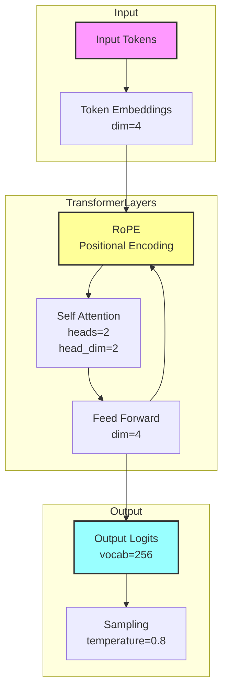

# Model Architecture

## Architectural Details

1. **Input Processing**
   - Byte-level tokenization (vocab size = 256)
   - 4-dimensional token embeddings

2. **Rotary Positional Embeddings (RoPE)**
   - Applied to queries and keys
   - Provides relative positional information
   - Maximum sequence length: 64 tokens

3. **Transformer Layer**
   - Multi-head attention (2 heads)
   - Head dimension: 2
   - Feed-forward dimension: 4
   - Layer normalization

4. **Output Generation**
   - Logits over 256 vocabulary items
   - Temperature-based sampling (default: 0.8)

The model is intentionally compact while maintaining the essential Transformer architecture components. This design allows for efficient training and inference while demonstrating the key concepts of attention mechanisms and positional embeddings.

### Key Features

- **RoPE Benefits**: Better handling of relative positions compared to absolute positional embeddings
- **Small But Complete**: Contains all essential Transformer components in a minimal form
- **Efficient Processing**: Small dimensions allow quick training and inference
- **Byte-Level Operations**: Can handle any text input without special tokenization
